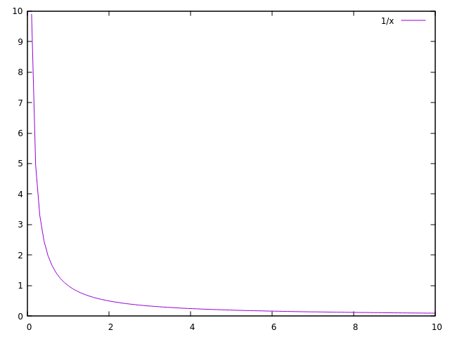
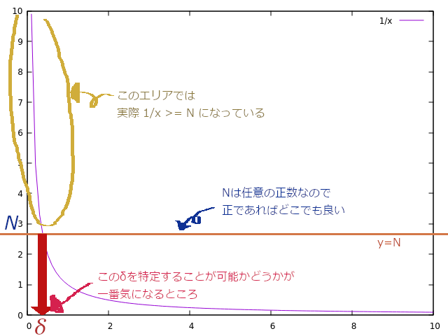

# 無限大についてのお話-簡単な演習問題を添えて

会津大学修学支援室

## はじめに
以前[$\varepsilon$-$N$論法についての記事](https://ofls.github.io/PublicMaterial/Calculus/epsilon.html)を作成しましたが、これはそのときには扱わなかった無限大についての解説記事です。  
また、前回の記事で具体的な証明の方法について触れなかったという反省を踏まえ今回は簡単な問題も扱いたいと思います。

## この記事の対象読者
- $\varepsilon$-$N$の記事を読んでくれた人
- $\varepsilon$-$N$や$\varepsilon$-$\delta$はなんとなく空気感くらいは分かったけれど、無限大になったら分からなくなった人
- 1%くらいは数学者の気持ちを分かってあげたい人
- テストに出なくても知識が増えること自体は嬉しいと思える人
- テストに出ないとしても序盤から分からない話が出てきたのが悔しい人

## 定義の確認（関数の極限）
関数の極限、すなわち

$\displaystyle \lim_{x \to a} f(x)=l$

とはどういう意味かを考えると、ざっくり言えば「$x$を$a$に近づければ$f(x)$が$l$に近づく」といった感じで認識することが多いと思います。それを教科書では極めて厳密な形で

*任意の正数 $\varepsilon$ に対して、$0<\lvert x - a\rvert<\delta$である任意の$x$に対して $\lvert f(x) - l \rvert<\varepsilon$となるような$\delta$が存在する*

と書かれていると思います。それを（前の記事のように）読み替えると

*適当に小さい数$\varepsilon$を決めたとすると、$x$ と $a$ との距離をあるいい感じの小さい数 $\delta$ 未満にすれば $f(x)$ と $l$の間の距離がさっき決めた $\varepsilon$ 未満になる*

と解釈することができます。$\varepsilon$は皆さんが適当に決めてよい数、$\delta$がその都度適切に決まる数というのがポイントでした。

「難しい表現を持ってきてから緩い表現に戻す意味ってあったんですか？」  
「あります。$\varepsilon$や$\delta$を使った表現にしないと実際の問題で証明ができません。」

## 無限大に発散するということ
例えば

$\displaystyle \lim_{x \to a} f(x)=\infty$

の場合、そもそも$\infty$が先程の$l$のような一定値ではないため上記の定義をそのまま当てはめるのは難しそうです。  
重要なのは$x$が$a$に近づくほど大きくなる（※）ということなので、  
※たまには減少してもOKですが、ざっくり見て大きくなり続けている必要があります。

*任意の正数 $N$ に対して、$0<\lvert x - a\rvert<\delta$である任意の$x$に対して$f(x) > N$となるような $\delta$ が存在する*

と定義することができます。資料によって$N$だったり$K$だったり$R$だったりしますが使う文字は何でも構いません。  
これも言い換えるならば、

*$\displaystyle \lim_{x \to a} f(x)=\infty \Leftrightarrow$「 $N$ を適当に決めたとして、$x$ と $a$の間の距離を十分に縮めれば $f(x)$ が $N$ より小さくなることはない」*

ということになります。

## 演習問題
前回の記事の反省点として「定義は一応解説したが問題での使い方までは説明しなかった」ということが挙げられるので、今回は簡単な証明問題をやってみたいと思います。

問題

$\displaystyle \lim_{x \to +0} \frac{1}{x} = \infty$ であることを証明せよ

$y=\frac{1}{x}$のグラフは以下のようになるので、$x$が$0$に近づけば近づくほど$y$が大きくなる、上の定義の言葉で言えば「$N$を適当に決めても、$x$が$0$に十分近づけば間違いなく$y$は$N$より大きいままである」ということ自体は受け入れられると思います。なお、この問題では$x\leq 0$の区間は無視して大丈夫です。

さて、直感的には明らかなこの結果をどうやって証明するかを考えましょう。
現時点での問題点は「$x$が$0$に十分近づけば」の「十分」というのがどれくらいなのか（厳密な定義では$\delta$と書いたとこ）があやふや過ぎることです。その$\delta$をずばり「この値」と言い切ることができれば一気に説得力が増します。改めて図で考えましょう。

今回の問題では「証明できる」というのは「$\delta$を$N$を含む式で表した上で定義で示した表現っぽくできる」という意味であると読み替えて構いません。  
図から、

$\displaystyle \frac{1}{x} > N$

という不等式を解けばそのときボーダーとなる $x$ こそが $\delta$ であることが分かります。式変形を行うと

$\displaystyle 0 < x < \frac{1}{N}$

※ $0$ は変形前の式にはありませんが、今回の問題では $x>0$ の区間しか見ないので $0$ を追加しました。

となり、この$\frac{1}{N}$が$\delta$です。無事に$N$を使って表現することができました。

実際、例えばあなたが$N=1000$と決めたとすれば、$\delta=\frac{1}{1000}$とすることで$0<x<\delta$の区間で$\frac{1}{x}>N(=1000)$となります。$N$をもっと大きな値にしてもそれに応じて$\delta$を適切に決めれば成り立ちます。

## 証明　極端な話、書くのはこれだけでもOK
任意の正数$N$について$\displaystyle \delta=\frac{1}{N}$とおけば、区間 $0<x<\delta$ で $\displaystyle \frac{1}{x} > N$となる.

よって、$\displaystyle \lim_{x \to +0} \frac{1}{x} = \infty$

「何か、正直言って証明した気がしないです」  
「必要な計算は$\delta$の値を調べる段階で済ませてしまいましたからね。実のところ、準備段階で**不等式を $0<x<\frac{1}{N}(=\delta)$ の形で解けた時点でほぼ勝ち確**です。例えばこれが『本当は無限大にならない』とかいそういう問題であれば特定の$N$については解が存在しなかったり、肝心の$a$（今回は $0$ でした）の付近では成り立たなかったりとかそういうおかしなことになります。」  
「教科書とかだとやたらと証明が短いのは$\delta$を導出するのを別のところでやっていたからなんですね」  
「そういうところです。書くのがめんどくさかったのか、あるいは著者にとっては本当に直感的に明らかなことだったのでしょう。  
ともかくこれで無事に1問解くことができました。$-\infty$に発散するものも考え方はほぼ同じです。また、今回は$x\rightarrow\infty$の場合については扱いませんでしたが、定義の読み替えにも慣れてきたと思いますので『何を証明できれば良いのか』を考えつつ取り組んでみてください。」

## お知らせ
修学支援室では「授業で難しく感じたところ」に関するアンケートを実施中です。
全てではありませんがこんな風に記事になる可能性がありますのでぜひ調査にご協力いただければと思います。

[授業で難しかったところについてのアンケート](https://docs.google.com/forms/d/e/1FAIpQLScWKlr5Q9ctfumYM_BZsII-UX1ToD6e8-OLpqSH8biI9AJ7Gg/viewform?usp=sf_link)