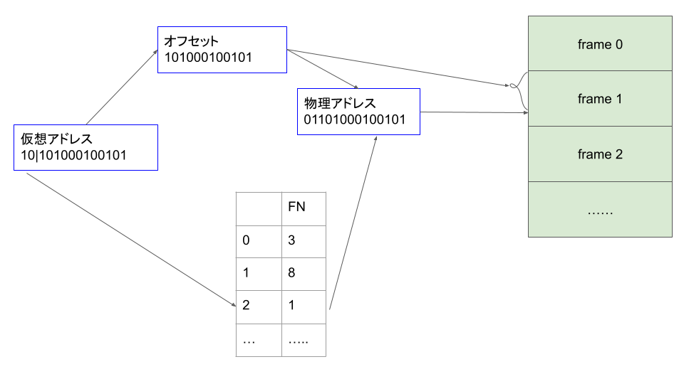

# 仮想アドレスと物理アドレスについて

## Step1 ページサイズを2の累乗の形に直します。
例) ページサイズが$4KB$のとき

$4KB = 2^{12}$ 

 

## Step2 与えられた仮想アドレスを2進数に直します。
例) VA: $10789$ と与えられたとき以降の作業で仮想アドレスをbitで扱いたいので

$10789 = 10101000100101_{(2)}$

にします。

 

## Step3 オフセットとページナンバーを求めます。

ページサイズが$2^n$のとき、仮想アドレスの $n$ bit がページオフセットになり、それより上位のbitがページナンバーになります。

上記の例を用いると

例) $n=12$となるので$10|101000100101$と分けられ、

オフセット: $101000100101$

ページナンバー： $10$

 

## Step4 フレームナンバーを求める。

ページテーブルから先ほど分かったページナンバーを利用することで、フレームナンバーは求められます。

例)
Step3よりページナンバーが$2$なので以下のページテーブルより

フレームナンバー: $01$ となる

<b>ページテーブル</b>
|  table num |  フレームナンバー  |
| :---: | :--- |
|  0  |  3  |
|  1  |   8 |
|  2  |    1|
|  ... |  ...  |

物理メモリにページが存在しないことを示すvalid-invalid bitがページテーブルにはあるが、上では省略してます。このときinvalidを示すならばページフォルトが発生します。

 

## Step5 物理アドレスを求める
以上のStepから求められたフレームナンバーとオフセットを組み合わせれば
物理アドレスとなるので

物理アドレス: $01101000100101$

 

## Step6 物理メモリからデータを持っていきます。
例) 物理アドレス: $01101000100101$ であるから

 

## お知らせ

修学支援室では「授業で難しく感じたところ」に関するアンケートを実施中です。
全てではありませんがこんな風に記事になる可能性がありますのでぜひ調査にご協力いただければと思います。

[授業で難しかったところについてのアンケート](https://docs.google.com/forms/d/e/1FAIpQLScWKlr5Q9ctfumYM_BZsII-UX1ToD6e8-OLpqSH8biI9AJ7Gg/viewform?usp=sf_link)
